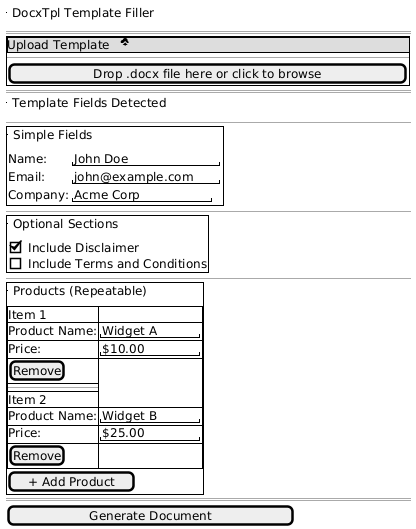

# POC Proposal: Dynamic Word Template Filler

## Executive Summary

A web-based application that enables users to upload Word document templates using simple placeholder syntax and dynamically generate filled documents through an intuitive form interface.

---

## Business Need

Organizations frequently need to generate customized Word documents from templates (contracts, invoices, reports). Current solutions require technical knowledge of complex templating systems. This POC demonstrates a user-friendly approach using intuitive placeholder syntax.

---

## Proposed Solution

### Template Syntax Support

| Syntax | Purpose | Example |
|--------|---------|---------|
| `{field}` | Simple text placeholder | `{name}`, `{email}` |
| `{#section}...{/section}` | Conditional content | `{#disclaimer}Legal text{/disclaimer}` |
| `{#list}...{/list}` | Repeatable sections | `{#products}{name} - {price}{/products}` |

### System Architecture

```
+-------------+     +-------------+     +-------------+
|   React     |---->|   FastAPI   |---->|   docxtpl   |
|  Frontend   |<----|   Backend   |<----|   Engine    |
+-------------+     +-------------+     +-------------+
      |                   |                   |
      v                   v                   v
 Dynamic Form      Template Parser     Document Gen
```

### User Interface Wireframe



---

## Key Features

1. **Drag & Drop Upload** - Simple template upload with validation
2. **Auto-Detection** - Automatically extracts fields, conditionals, and lists
3. **Dynamic Forms** - Generates appropriate input controls per field type
4. **Repeatable Sections** - Add/remove items for list-type content
5. **Conditional Sections** - Toggle optional content via checkboxes
6. **Instant Generation** - Download filled document immediately

---

## Technical Stack

| Component | Technology |
|-----------|------------|
| Frontend | React + TypeScript + Vite |
| Backend | Python + FastAPI |
| Template Engine | python-docx-template (docxtpl) |
| Document Format | OOXML (.docx) |

---

## Success Criteria

- [ ] Parse templates with `{field}`, `{#conditional}`, `{#list}` syntax
- [ ] Generate dynamic form UI from parsed template
- [ ] Support add/remove for repeatable sections
- [ ] Generate filled documents preserving original formatting
- [ ] Handle empty/optional fields gracefully

---

## Timeline Estimate

| Phase | Duration |
|-------|----------|
| Backend Parser & Generator | 2 days |
| Frontend Dynamic Form | 2 days |
| Integration & Testing | 1 day |
| **Total** | **5 days** |

---

*Document generated from implemented POC solution*
